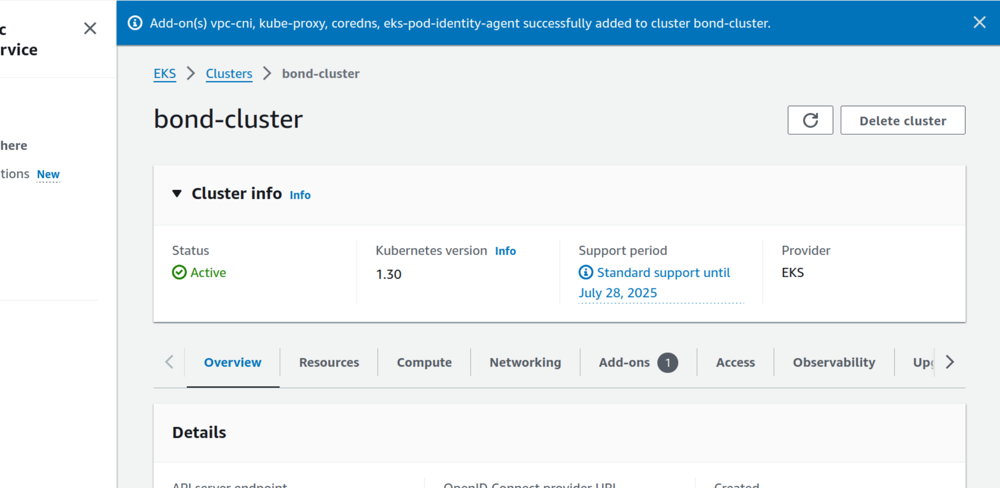
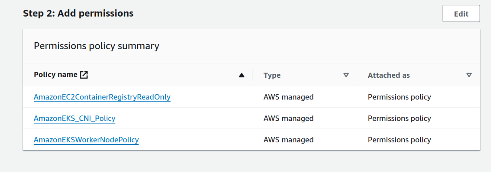
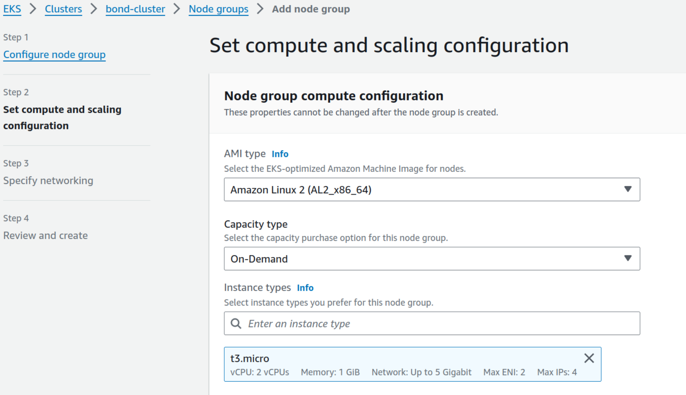
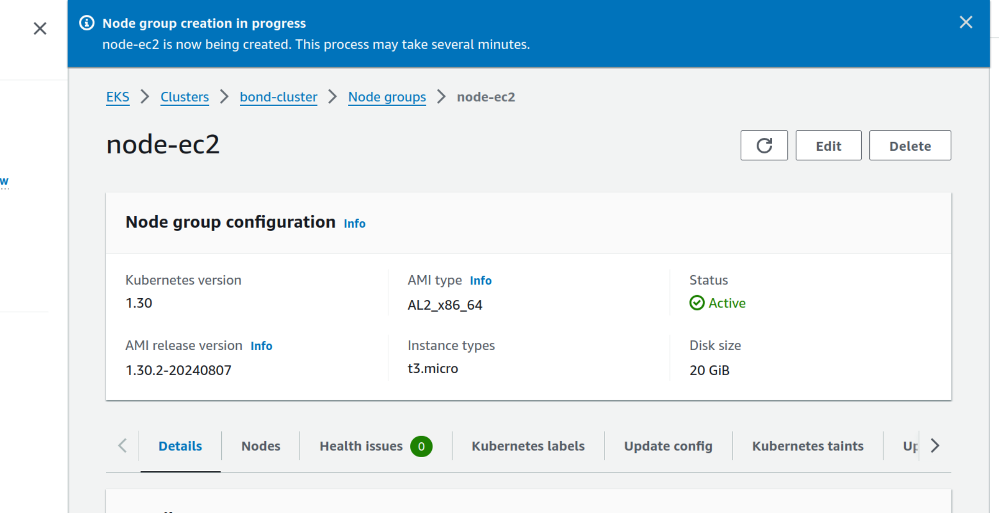
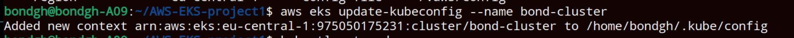

<h1>AWS EKS Cluster</h1>
<h2>Technologies used</h2>

- <b>Kubernetes</b> 
- <b>AWS EKS</b>

<h2>Detailed Description of Project </h2>
1. Configure necessary IAM roles 
2. Create VPC with Cloudformation Template for worker nodes 
3. Create EKS cluster (Control Plane Nodes) 
4. Create Node Group for Worker Nodes and attach to EKS cluster 
5. Configure Auto-scaling of worker nodes 
6. Deploy a sample application to EKS cluster 

   

   <h2>step1    Configure IAM Role for EKS Cluster</h2>
   Create a new role in the IAM service of AWS 
   Select EKS cluster service 
   Add AmazonEKSClusterPolicy to the role 
   

 

   <h2>step2  Create VPC with Cloudformation Template for worker Nodes</h2>
   EKS cluster needs specific networking configuration 
   Default VPC is not optimized for it 
   Search aws documentation for Yaml configuration file for creating VPC for eks cluster 
   Create stack in aws cloudformation 
   Copy and paste the url template in the text area under Amazon s3 url  
   
  link:   https://s3.us-west-2.amazonaws.com/amazon-eks/cloudformation/2020-10-29/amazon-eks-vpc-private-subnets.yaml 

  Give your stack a name and create vpc  

  vpc is created with the name 'vpc-stack'
   

  

   <h2>step3 Create EKS cluster</h2>
   Create Kubernetes cluster from Elastic Kubernetes Service  
   Configuration 
   use the created IAM role as the cluster service role  
   Networking configuration 
   the created VPC is used as the VPC for the cluster 

   Cluster is created and acive  
    
   

 
   
   

   <h2>step4  Create Node Group for Worker Nodes and attach to EKS cluster</h2>
   Before creating the nodes in the cluster, Create IAM role for the node Group  
   
   
   IAM role is given 3 permissions 
    

   Create nodegroups in the cluster from "compute" 
   The created IAM role is selected for the node IAM role during creation  
   Select the nodetype 
   Capacity and ImageType 

    

   NodeGroup successfully created 
    

   The cluster can be connected to  
    

 
     

